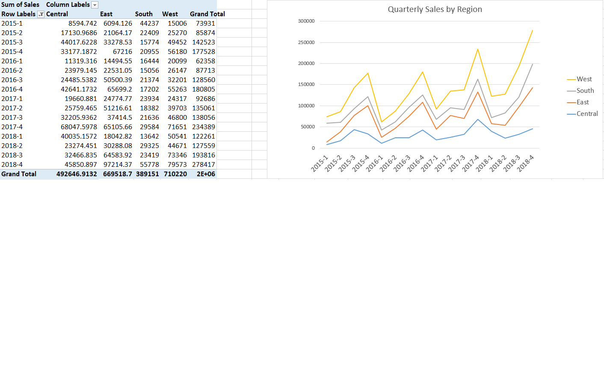

# Excel Sales Analysis

This section presents an exploratory sales analysis using Microsoft Excel.

The analysis was performed using:

- Pivot Tables
- Pivot Charts
- Business Questions
- Data Storytelling

The objective was to identify sales trends, regional performance, customer behavior, and product insights from the Superstore dataset.

---

## Business Questions

## 1. Which region generated the highest sales over time?

### Findings
- The West region consistently generated the highest quarterly sales.
- Sales across all regions generally peaked during Q4, indicating a recurring seasonal pattern.
- Based on these findings, the next analysis focuses on the West region during Q4 to identify the key drivers of sales.

## Business Question 2

### Which product category generated the highest sales in the West region during Q4?

To identify the main driver behind the West region's strong seasonal performance, product categories were analyzed during the fourth quarter (Q4) for each year from 2015 to 2018.

| Year (Q4) | Top Category | Sales |
|-----------|--------------|-------:|
|2015|Furniture|20,558|
|2016|Furniture|21,761|
|2017|Furniture|30,411|
|2018|Furniture|32,119|

### Findings

- Furniture was the highest-selling product category in the West region during Q4 in every year from 2015 to 2018.
- Furniture sales increased from approximately 20.6K in 2015 to 32.1K in 2018, indicating sustained growth.
- The results suggest that Furniture consistently played a key role in the West region's strong Q4 performance.

## 3. Which region contributed the most to overall sales and profit?
   images/profit_sales_by_region.png

   ### Findings

- The West region contributed the highest share of both total sales and total profit.
- The East region ranked second in both sales and profit.
- South generated the lowest contribution, while Central showed moderate performance.
- The similar distribution of sales and profit across regions suggests that higher sales generally resulted in higher profit.

## 4. Which products generated the highest sales across different customer segments?

